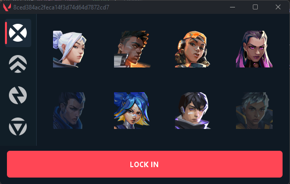

<div align="center">

# 🎯 Instalocker

**An automatic agent locker for Valorant** — the moment the agent-select (pregame) screen opens, it instantly locks in the agent you chose.




</div>

---

## ✨ Features

- ⚡ **Auto-lock** — locks your agent within milliseconds of pregame opening
- 🎭 **All agents**, filtered by role (Duelist · Controller · Initiator · Sentinel)
- 🔓 **Ownership detection** — agents you own are enabled automatically from your inventory
- 🎨 **Premium UI** — HD icons, Valorant-themed dark/red design
- 🔁 **Resilient** — retries with `select` + `lock` if a direct lock fails, and refreshes the token when it expires

## 📦 Requirements

- **Valorant** (currently configured for the **EU** region)
- **JDK 15+** (the project is built with Amazon Corretto 15)
- **IntelliJ IDEA** (or Maven)

## 🚀 Setup & Usage

```bash
git clone https://github.com/Ox85/valorant-instalocker.git
```

1. Open the project in **IntelliJ IDEA** and let Maven pull the dependencies (`gson`, `darklaf`, `commons-io`).
2. Run `start.java` **while Valorant is open**.
3. In the UI: **pick a role → pick an agent → `LOCK IN`** (the button switches to "STOP", meaning it's now waiting).
4. Queue a match. **When the agent-select screen opens, your agent is locked automatically.** 🎯

> ℹ️ On launch the program downloads `data.json` (agent list) and `assets.zip` (icons) from a GitHub repository and extracts them to a temp folder. That repository is defined by the **`REPO_OWNER` / `REPO_NAME` / `REPO_BRANCH`** constants in `start.java` — change those if you want to use your own data repo. (No administrator rights required.)

## 🔒 Is it safe?

**In terms of malware — it's transparent:**

- ✅ **Fully open source.** You can read every line yourself.
- ✅ **It does not steal your password/account and sends it nowhere.** It only talks to Valorant's **local** client API (`lockfile`) on your own machine and Riot's **official** servers.
- ✅ No personal data is sent to any third party (only icons/agent list are downloaded from GitHub).

**⚠️ BUT in terms of ban risk — there is NO guarantee:**

- Instalockers **violate Valorant's Terms of Service** (third-party software that interacts with the game).
- **Riot Vanguard** can detect tools like this → **there is a risk of an account ban.**
- This project is **for educational and learning purposes.** Use it **entirely at your own risk.**

## 🛠️ How it works

1. Reads the port + password from the local `lockfile` and obtains the entitlements token.
2. Reads `X-Riot-ClientVersion` from the **real client version** in `ShooterGame.log` (a wrong version is rejected by Riot).
3. Polls the `pregame/v1/players/{puuid}` endpoint; catches the match when it returns 200 + a MatchID.
4. Sends a POST to `pregame/v1/matches/{matchID}/lock/{agentID}` to lock the agent.

## ⚖️ Disclaimer

This project is **not affiliated with, endorsed by, or sponsored by Riot Games.** "VALORANT" and all related assets belong to Riot Games. The software is provided "as is"; the developer is not responsible for any consequences (including account bans) resulting from its use.
